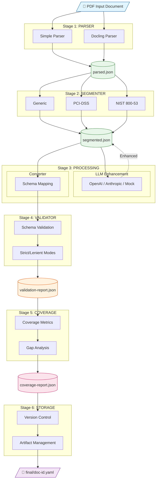
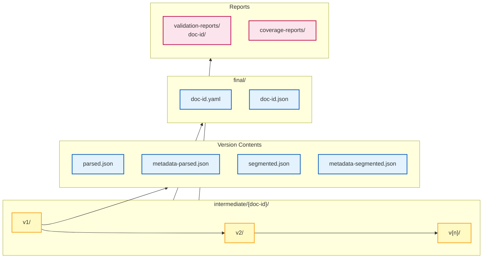
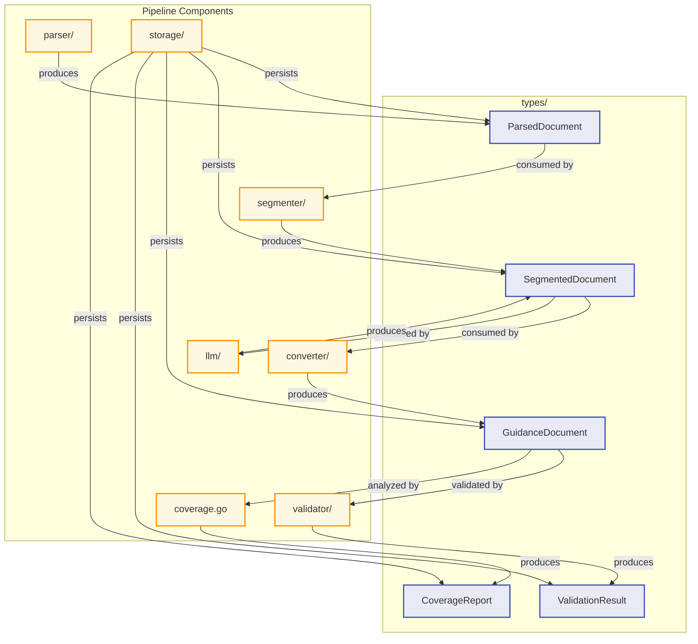
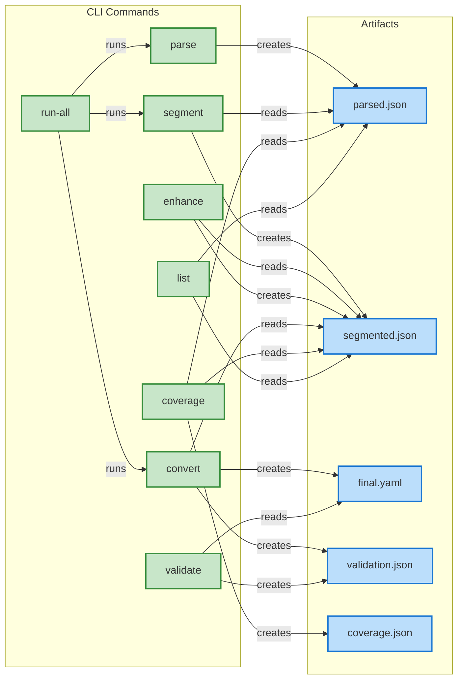

# Gemara Layer-1 Structured Guideline Extraction Pipeline: Technical Specification

This document details the technical pipeline designed to automatically transform complex, semi-structured compliance documents (e.g., PCI-DSS, NIST 800-53) in PDF format into the robust, standardized Gemara Layer-1 YAML/JSON schema for the task CPLYTM-1179. The pipeline exists in the github as `mcp-layers-research/layer1/pipeline`.

## 1. Pipeline Status

| Component | Status | Key Functionality |
|-----------|--------|-------------------|
| Parser | In Progress | Raw text/metadata extraction + factory support. Integrate basic and advanced parser backends (e.g., Simple text, Docling). |
| Segmenter | In Progress | Generic, PCI-DSS v3.2.1, and NIST 800-53 R5 rule-sets defined. |
| Converter | In Progress | Implement transformation logic with schema validation. |
| **Validator** | **Implemented** | **Schema validation with strict/lenient modes and detailed error reporting.** |
| **Coverage Analyzer** | **Implemented** | **Analyzes schema coverage, identifies unmapped content and schema gaps.** |
| LLM Enhancement | Testing only | Data quality improvement and structural validation (Optional). |
| Storage | In Progress | Version control and artifact management. |
| **Types** | **Implemented** | **Core data structures for all pipeline stages.** |

## 2. Architecture Overview

The pipeline employs a staged, non-linear architecture that leverages versioned intermediate artifacts to enable re-runnability and optional quality enhancement via Large Language Models (LLMs).

### 2.1. Main Pipeline Flow



### 2.2. Data Flow and Versioning



### 2.3. Component Interactions



### 2.4. CLI Command Flow



### Design Considerations:

- **Performance**: Intermediate artifacts use JSON for significantly faster processing and deserialization within the Go implementation. The final output is configurable (YAML or JSON).
- **Version Control**: Both Intermediate Storage and Block Storage are versioned, allowing for clear traceability and rollback capabilities in case of parser or segmenter updates.
- **Audit Trail**: Validation reports are persisted with timestamps for compliance auditing.
- **Coverage Tracking**: Unmapped content is tracked to identify schema gaps and improvement opportunities.

## 3. Core Pipeline Components

The pipeline for PDF → Layer-1 conversion is composed of **seven** distinct, chained, and re-runnable modules:

### 3.1. Types (types/)

**Purpose**: Defines all core data structures used throughout the pipeline.

**Key Types**:
- `ParsedDocument`: Raw output from PDF parsing (pages, blocks, metadata)
- `SegmentedDocument`: Structured document with categories, guidelines, and parts
- `Block`: Content block with type (heading, paragraph, list, table), formatting, and position
- `UnmappedContent`: Content that couldn't be captured by the schema
- `CoverageStats`: Statistics on schema coverage
- `SchemaGap`: Identified gaps in the schema
- `EnhancementResult`: Result of LLM enhancement operations
- `ParserConfig`, `SegmenterConfig`, `LLMConfig`: Configuration structures

### 3.2. Parser (parser/)

**Purpose**: Extracts raw text, inherent formatting (headings, lists, tables), and structural metadata from the input PDF document.

**Technologies**: 
- Simple parser (built-in text extraction)
- Docling (advanced PDF parsing via Python bridge)
- Library: Poppler

**Parser Interface**:
```go
type Parser interface {
    Parse(filePath string) (*types.ParsedDocument, error)
    Name() string
    Configure(config types.ParserConfig) error
}
```

**Output**: Intermediate JSON files:
- `test-data/intermediate/{document-id}/v{version}/parsed.json`
- `test-data/intermediate/{document-id}/v{version}/metadata-parsed.json`

### 3.3. Segmenter (segmenter/)

**Purpose**: Applies deterministic, document-specific, and generic rule-sets to logically structure the parsed raw data. It is responsible for identifying the boundaries of individual guidelines, control categories, sub-parts, and appendices.

**Available Segmenters**:
- `GenericSegmenter`: Universal rules for numbered sections (e.g., "1.", "1.1", "1.1.1")
- `PCIDSSSegmenter`: PCI-DSS v3.2.1 specific patterns (Requirements, REQ-X format)
- `NIST80053Segmenter`: NIST 800-53 patterns (AC, AT, AU control families)

**Segmenter Interface**:
```go
type Segmenter interface {
    Segment(doc *types.ParsedDocument) (*types.SegmentedDocument, error)
    Name() string
    Configure(config types.SegmenterConfig) error
}
```

**Input**: Parsed intermediate JSON data.

**Output**: Segmented blocks JSON files:
- `test-data/intermediate/{document-id}/v{version}/segmented.json`
- `test-data/intermediate/{document-id}/v{version}/metadata-segmented.json`

**Coverage Tracking**: Segmented documents include:
- `UnmappedContent[]`: Content that couldn't fit in the schema
- `CoverageStats`: Block-level coverage metrics

### 3.4. Converter (converter/)

**Purpose**: Validates the segmented blocks against the defined Gemara Layer-1 JSON schema and performs the final transformation into the target structure.

**Converter Interface**:
```go
type Converter interface {
    Convert(doc *types.SegmentedDocument) (*layer1.GuidanceDocument, error)
    Name() string
}
```

**Features**:
- Maps `SegmentedDocument` → `layer1.GuidanceDocument`
- Converts metadata, categories, guidelines, and parts
- Integrates with Validator for schema compliance checking
- `ConvertAndValidate()`: Combined conversion and validation in one step

**Input**: Segmented blocks JSON data.

**Output**: Valid Layer-1 YAML/JSON file:
- `test-data/final/{document-id}.yaml` or `.json`

### 3.5. Validator (validator/)

**Purpose**: Performs schema validation of Layer-1 documents against the CUE schema specification.

**Validator Interface**:
```go
type Validator struct {
    strict bool // If true, treat warnings as errors
}

func (v *Validator) Validate(doc *layer1.GuidanceDocument) *ValidationResult
func (v *Validator) ValidateJSON(data []byte) (*ValidationResult, error)
func (v *Validator) ValidateYAML(data []byte) (*ValidationResult, error)
```

**Validation Checks**:
- **Required Fields**: `metadata.id`, `metadata.title`, `metadata.description`, `metadata.author`
- **Document Type**: Must be one of: `Standard`, `Regulation`, `Best Practice`, `Framework`
- **Categories**: At least one category required, no duplicate IDs
- **Guidelines**: Required fields (id, title), no duplicate IDs within category
- **Parts**: Required fields (id, text)
- **Mappings**: Valid reference IDs, strength values (0-100)

**Modes**:
- **Lenient Mode**: Allows optional fields to be empty
- **Strict Mode**: Treats warnings as errors, enforces document-type

**Output**: `ValidationResult` with `Valid` flag and `[]ValidationError`

### 3.6. Coverage Analyzer (validator/coverage.go)

**Purpose**: Analyzes how well the source document content maps to the Layer-1 schema and identifies gaps.

**Coverage Analyzer Interface**:
```go
type CoverageAnalyzer struct {
    strictMode bool
}

func (a *CoverageAnalyzer) AnalyzeFromSegmented(parsed, segmented) *CoverageReport
func (a *CoverageAnalyzer) AnalyzeLayer1(doc *layer1.GuidanceDocument) *CoverageReport
```

**Coverage Report Includes**:
- **Source Stats**: Total pages, blocks, characters, block types
- **Captured Content**: Categories, guidelines, parts, recommendations count
- **Coverage Metrics**: 
  - Block coverage percentage
  - Required/optional fields covered
  - Overall score (0-100)
  - Quality indicators
- **Unmapped Content**: Content that couldn't be captured
- **Schema Gaps**: Identified gaps with priority and examples
- **Recommendations**: Suggestions for schema improvements

**Output**: `coverage-reports/{document-id}-{timestamp}.json`

### 3.7. LLM Enhancement (Optional) (llm/)

**Purpose**: An optional quality assurance and enhancement layer. It uses Large Language Models to handle complex edge cases (e.g., deeply nested logic, ambiguous formatting) or to semantically validate structural mappings.

**Enhancer Interface**:
```go
type Enhancer interface {
    EnhanceSegmentation(ctx, doc) (*types.EnhancementResult, error)
    ValidateMetadata(ctx, meta) (*types.EnhancementResult, error)
    EnhanceGuideline(ctx, guideline) (*types.EnhancementResult, error)
    Name() string
    Configure(config types.LLMConfig) error
}
```

**Supported Providers**:
- `openai`: OpenAI API (GPT models)
- `anthropic`: Anthropic API (Claude models)
- `mock`: Mock implementation for testing

**Mode**: Designed to be re-runnable independently of the initial PDF parsing/segmentation steps.

**Input/Output**: Processes segmented blocks or preliminary Layer-1 data, yielding enhanced/validated data ready for the Converter.

**Version Tracking**: Enhanced documents are saved with descriptive labels (e.g., "post-enhance-openai (pre-enhance: v1)")

### 3.8. Storage (storage/)

**Purpose**: Manages the persistence, versioning, and tracking of all pipeline inputs and outputs.

**Storage Interface**:
```go
type Storage struct {
    baseDir string
}

// Parsed documents
func (s *Storage) SaveParsed(doc *types.ParsedDocument) error
func (s *Storage) LoadParsed(documentID string, version int) (*types.ParsedDocument, error)

// Segmented documents
func (s *Storage) SaveSegmented(doc *types.SegmentedDocument) error
func (s *Storage) SaveSegmentedWithLabel(doc, label string) error
func (s *Storage) LoadSegmented(documentID string, version int) (*types.SegmentedDocument, error)

// Final documents
func (s *Storage) SaveFinal(documentID string, data interface{}, format string) error
func (s *Storage) SaveFinalWithValidation(documentID, data, format, report) error
func (s *Storage) LoadFinal(documentID string) (*layer1.GuidanceDocument, error)

// Validation reports
func (s *Storage) SaveValidationReport(report *ValidationReport) error
func (s *Storage) LoadValidationReports(documentID string) ([]ValidationReport, error)

// Version management
func (s *Storage) ListVersions(documentID, docType string) ([]StorageMetadata, error)
```

**Features**:
- **Version Tracking**: Artifacts for all stages (Parser, Segmenter, Converter) are versioned
- **Type-Specific Metadata**: Separate metadata files per artifact type (`metadata-parsed.json`, `metadata-segmented.json`)
- **Rollback Capability**: Enables quick reversion to previous, known-good states
- **Diff Comparison**: Allows comparison between different parser/segmenter versions
- **Metadata Tracking**: Stores essential context (e.g., parse date, parser version, segmentation ruleset used)
- **Validation Reports**: Persisted for audit trail
- **Labeled Versions**: Support for descriptive labels on enhanced documents

**Directory Structure**:
```
test-data/
├── intermediate/
│   └── {document-id}/
│       ├── v1/
│       │   ├── parsed.json
│       │   ├── metadata-parsed.json
│       │   ├── segmented.json
│       │   └── metadata-segmented.json
│       └── v2/
│           └── ...
├── final/
│   ├── {document-id}.yaml
│   └── {document-id}.json
├── validation-reports/
│   └── {document-id}/
│       └── convert-{timestamp}.json
├── coverage-reports/
│   └── {document-id}-{timestamp}.json
└── temp/
    └── parsed-{id}.txt
```

## 4. Usage Examples: CLI Commands

The pipeline is designed to be executed via a command-line interface (CLI) in a staged manner.

### 4.1. Complete Pipeline Execution

```bash
# Run complete pipeline: parse -> segment -> convert
go run ./layer1/pipeline/cmd/pipeline/main.go run-all \
    --input PCI_DSS_v3-2-1.pdf \
    --document-id pci-dss-3.2.1 \
    --segmenter pci-dss
```

### 4.2. Step-by-Step Execution

```bash
# 1. Parse PDF: Extracts raw content and saves to intermediate storage
go run ./layer1/pipeline/cmd/pipeline/main.go parse \
    --input PCI_DSS_v3-2-1.pdf \
    --document-id pci-dss-3.2.1 \
    --parser simple

# 2. Segment parsed data: Applies PCI-DSS specific rules
go run ./layer1/pipeline/cmd/pipeline/main.go segment \
    --document-id pci-dss-3.2.1 \
    --segmenter pci-dss

# 3. Convert to Layer-1: Validates segmented data and generates final YAML output
go run ./layer1/pipeline/cmd/pipeline/main.go convert \
    --document-id pci-dss-3.2.1 \
    --output pci-dss-3.2.1.yaml \
    --format yaml
```

### 4.3. LLM Enhancement (Re-runnable)

```bash
# Enhance with LLM - can be re-run on existing segmented data
go run ./layer1/pipeline/cmd/pipeline/main.go enhance \
    --document-id pci-dss-3.2.1 \
    --llm-provider openai \
    --llm-model gpt-4 \
    --llm-api-key $OPENAI_API_KEY
```

### 4.4. Validation

```bash
# Validate Layer-1 document from storage
go run ./layer1/pipeline/cmd/pipeline/main.go validate \
    --document-id pci-dss-3.2.1 \
    --strict

# Validate external Layer-1 file
go run ./layer1/pipeline/cmd/pipeline/main.go validate \
    --validate-file ./my-document.yaml \
    --strict
```

### 4.5. Coverage Analysis

```bash
# Analyze schema coverage from storage
go run ./layer1/pipeline/cmd/pipeline/main.go coverage \
    --document-id pci-dss-3.2.1 \
    --save-report

# Analyze external Layer-1 file
go run ./layer1/pipeline/cmd/pipeline/main.go coverage \
    --validate-file ./my-document.yaml
```

### 4.6. Version Management

```bash
# List all versions of a document
go run ./layer1/pipeline/cmd/pipeline/main.go list \
    --document-id pci-dss-3.2.1
```

## 5. CLI Options Reference

### Global Options
| Option | Default | Description |
|--------|---------|-------------|
| `--base-dir` | `./layer1/pipeline/test-data` | Base directory for storage |
| `--verbose` | `false` | Enable verbose output |

### Parse Options
| Option | Default | Description |
|--------|---------|-------------|
| `--input` | (required) | Input PDF file path |
| `--document-id` | filename | Document ID |
| `--parser` | `simple` | Parser type: `simple`, `docling` |

### Segment Options
| Option | Default | Description |
|--------|---------|-------------|
| `--document-id` | (required) | Document ID |
| `--segmenter` | `generic` | Segmenter type: `generic`, `pci-dss`, `nist-800-53` |
| `--source-version` | `0` (latest) | Source version to segment |

### Convert Options
| Option | Default | Description |
|--------|---------|-------------|
| `--document-id` | (required) | Document ID |
| `--output` | (optional) | Custom output file path |
| `--format` | `yaml` | Output format: `yaml`, `json` |
| `--strict` | `true` | Enable strict validation |
| `--save-report` | `true` | Save validation report |

### Enhance Options
| Option | Default | Description |
|--------|---------|-------------|
| `--document-id` | (required) | Document ID |
| `--llm-provider` | `mock` | LLM provider: `openai`, `anthropic`, `mock` |
| `--llm-model` | (optional) | LLM model name |
| `--llm-api-key` | (env var) | LLM API key |
| `--temperature` | `0.3` | LLM temperature |
| `--max-tokens` | `2000` | LLM max tokens |

### Validate Options
| Option | Default | Description |
|--------|---------|-------------|
| `--document-id` | (optional) | Document ID from storage |
| `--validate-file` | (optional) | Path to external file |
| `--strict` | `true` | Enable strict validation |
| `--save-report` | `true` | Save validation report |

### Coverage Options
| Option | Default | Description |
|--------|---------|-------------|
| `--document-id` | (optional) | Document ID from storage |
| `--validate-file` | (optional) | Path to external file |
| `--save-report` | `true` | Save coverage report |

## 6. Data Flow and Versioning

### 6.1. Version Tracking

Each stage produces versioned artifacts:
1. **Parsed**: `v1`, `v2`, ... (increments on each parse)
2. **Segmented**: `v1`, `v2`, ... (increments on each segment/enhance)
3. **Final**: Overwrites with latest conversion

### 6.2. Version Selection

Use `--source-version` to specify which version to use as input:
- `0` (default): Use latest version
- `N`: Use specific version N

### 6.3. Enhancement Versioning

LLM enhancement creates a new segmented version with a descriptive label:
```json
{
  "description": "post-enhance-openai (pre-enhance: v1)"
}
```

## 7. Validation and Coverage Reports

### 7.1. Validation Report Structure

```json
{
  "document_id": "pci-dss-3.2.1",
  "timestamp": "2025-12-11T11:47:22Z",
  "strict_mode": true,
  "valid": true,
  "error_count": 0,
  "errors": [],
  "source_version": 1,
  "stage": "convert"
}
```

### 7.2. Coverage Report Structure

```json
{
  "document_id": "pci-dss-3.2.1",
  "timestamp": "2025-12-11T11:48:27Z",
  "source_stats": {
    "total_pages": 139,
    "total_blocks": 2547,
    "total_characters": 385021
  },
  "captured_content": {
    "categories": 12,
    "guidelines": 245,
    "parts": 428
  },
  "coverage_metrics": {
    "overall_score": 87.5,
    "block_coverage": 92.3,
    "required_fields_covered": 4,
    "required_fields_total": 4
  },
  "unmapped_content": [...],
  "schema_gaps": [...],
  "recommendations": [...]
}
```

## 8. Pipeline Testing Details

This pipeline is currently being tested locally using the ossf gemara repository. The pipeline is utilizing a local PDF for analysis and is not using any API sources for the guidelines/frameworks or best practices, which is out of scope for this task. The architecture employed significant prompts to achieve a working workflow.

**Example Prompt**: 
> "Utilize the sample files, specifically the PCI-DSS and or any similar framework/guideline PDFs, treating Gemara Layer-1 as the contractual framework. Your primary task is to develop a reliable pipeline that transforms PDFs into structured blocks and ultimately into Gemara JSON/YAML.
>
> 1. Start with a deterministic first model that leverages regex and established rules for initial processing.
> 2. Implement mechanisms to address edge cases and enhance output quality using LLMs.
> 3. Ensure the preservation of comprehensive intermediate data by maintaining a stable and version-controlled storage system for both parser output and segmentation results.
>
> That way, when you introduce LLMs, you can re-run them over existing data without reparsing PDFs."

**Research**: There was significant research in terms of OSCAL formats, GRC formats for PCI such as from GApps, Gemara Layer schema, and the PCI DSS community Excel sheets. POC using available tools like https://github.com/docling-project/docling-serve and HURIDOCS.

## 9. File Structure

```
layer1/pipeline/
├── cmd/
│   └── pipeline/
│       └── main.go           # CLI entry point
├── converter/
│   ├── converter.go          # Layer-1 conversion logic
│   └── converter_test.go
├── llm/
│   ├── enhancer.go           # LLM enhancement interface
│   ├── providers.go          # OpenAI/Anthropic implementations
│   └── llm_test.go
├── parser/
│   ├── parser.go             # Parser interface and factory
│   ├── simple.go             # Simple text parser
│   ├── docling.go            # Docling parser wrapper
│   ├── docling_convert.py    # Python bridge for Docling
│   └── parser_test.go
├── segmenter/
│   ├── segmenter.go          # Generic segmenter
│   ├── specialized.go        # PCI-DSS, NIST 800-53 segmenters
│   └── segmenter_test.go
├── storage/
│   ├── storage.go            # Version control and persistence
│   └── storage_test.go
├── types/
│   └── types.go              # Core data structures
├── validator/
│   ├── validator.go          # Schema validation
│   ├── coverage.go           # Coverage analysis
│   └── validator_test.go
├── test-data/
│   ├── intermediate/         # Parsed and segmented versions
│   ├── final/                # Final Layer-1 outputs
│   ├── validation-reports/   # Validation audit trail
│   ├── coverage-reports/     # Coverage analysis reports
│   └── temp/                 # Temporary files
└── pipeline_test.go          # Integration tests
```

## 10. Future Enhancements

1. **Additional Parsers**: PyMuPDF, Adobe PDF Extract API
2. **Additional Segmenters**: ISO 27001, SOC 2, GDPR
3. **Enhanced LLM Integration**: Fine-tuned models for compliance documents
4. **Web UI**: Dashboard for pipeline management and report viewing
5. **CI/CD Integration**: Automated pipeline execution on document updates
6. **Schema Evolution**: Track and migrate between Layer-1 schema versions

